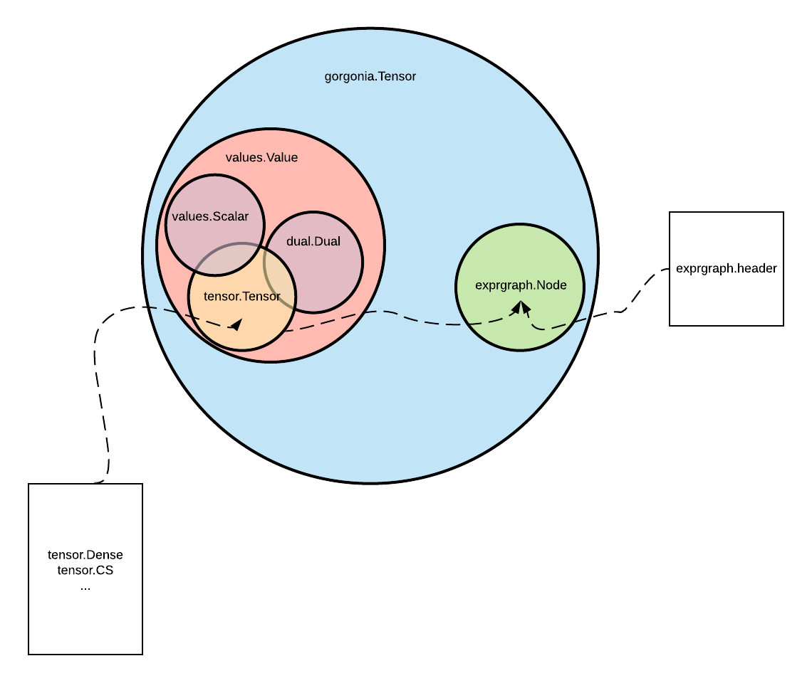

package exprgraph is an experimental rewrite of the basic graph data structure in Gorgonia. It is likely to fail and is not usable anywhere.

The goal is to rewrite the graph and nodes such that it creates less allocation. An idea is to separate the data from the structure.

# Exprgraph

## About

Exprgraph is a package holding a graph structure as a representation of a mathematical formulae.

### Graph

The top level structure of the package is a `*Graph` that is a direct, acyclic weighted graph. A graph is made up of `Node`s and edges.

### Node

A `Node` is many things. A `Node` represents a vertex in the expression graph. On its own it is also a symbolic tensor (see below). However, it can be turned into a value tensor as well.

### Interfaces

#### `Lifter`
A `Lifter` is something that can turn the underlying type of a `gorgonia.Tensor` into another `gorgonia.Tensor` of a different underlying type.

#### `gorgonia.Tensor`

A `gorgonia.Tensor` is a tensor that is acceptable for use in Gorgonia. There are two kinds of tensors:

1. Symbolic tensors.
2. Value tensors.

A **symbolic tensor** is a tensor that represents a value. It DOES NOT have any value. On the other hand, a **value tensor** are tensors that have data in them.

# Appendix: Types

Confused about the types used?

